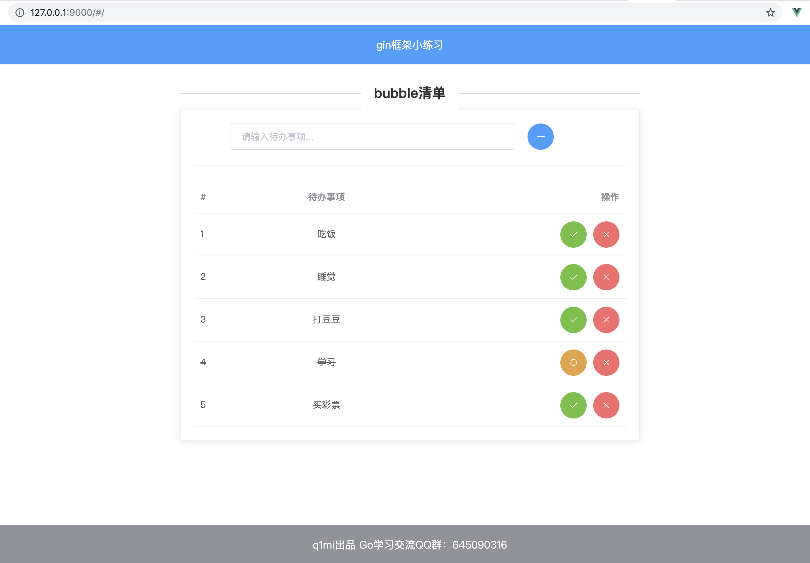

# 前言

本项目是基于 "bubble清单" 的基础上修改的，原项目的数据库是 `MySQL` ，经本人修改为 `Sqlite3` 数据库。在运行前需要配置 `Sqlite` 环境。


# bubble清单

一个基于gin+gorm 开发的练手小项目，通过该项目可初识go web开发该有的姿势。

前端页面基于vue和ElementUI开发，对前端不熟悉的童鞋可直接下载`templates`和`static`文件夹下的内容使用。

前端部分源码地址：[bubble_frontend](https://github.com/Q1mi/bubble_frontend)。


## 使用指南

### 原项目下载地址
```bash
git clone https://github.com/Q1mi/bubble.git
```
### 编译
```bash
go build
```

### 执行

Mac/Unix：
```bash
./bubble conf/config.ini
```
Windows:
```bash
bubble.exe conf/config.ini
```

启动之后，使用浏览器打开`http://127.0.0.1:9000/`即可。

